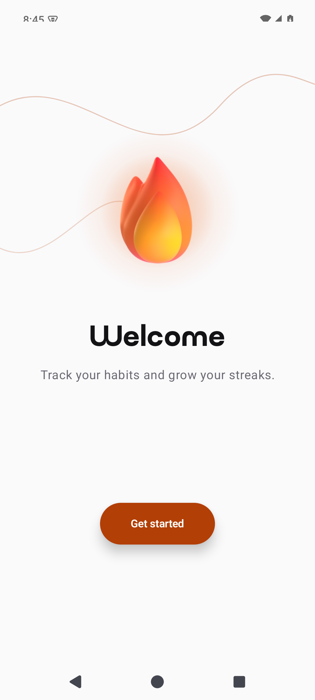
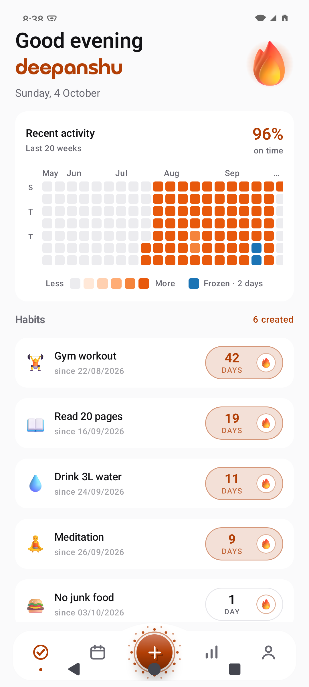
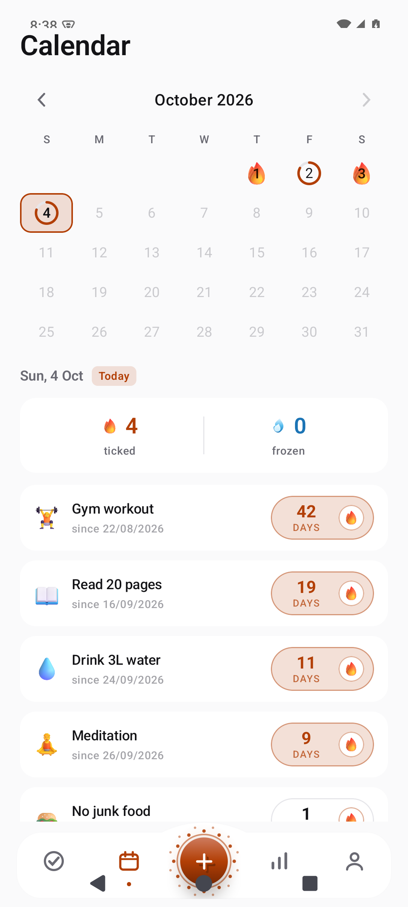
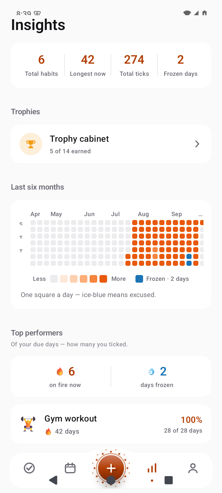
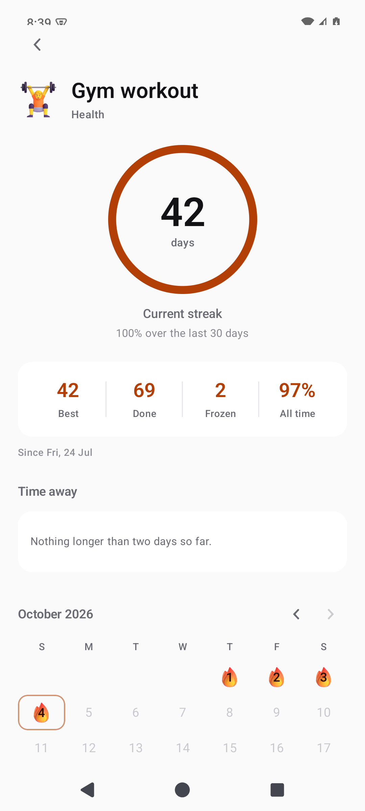
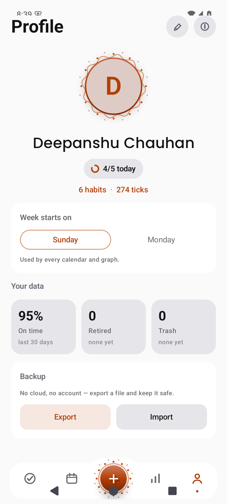
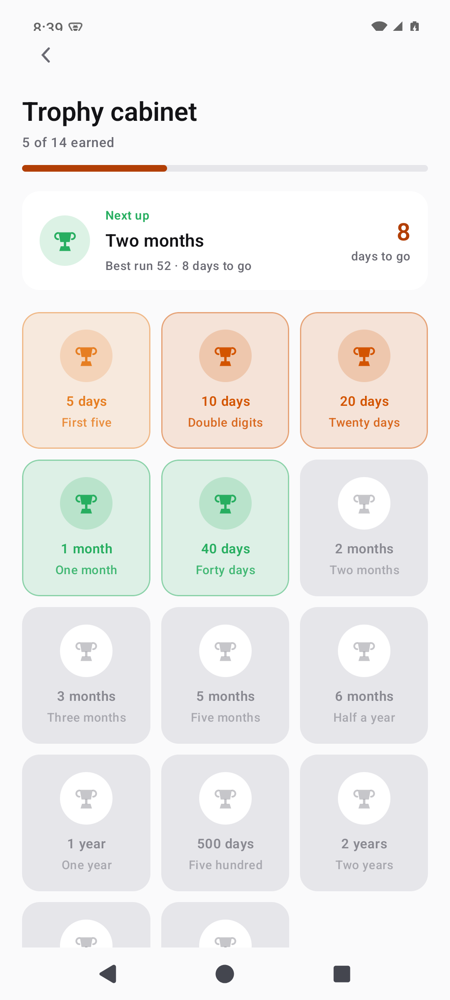
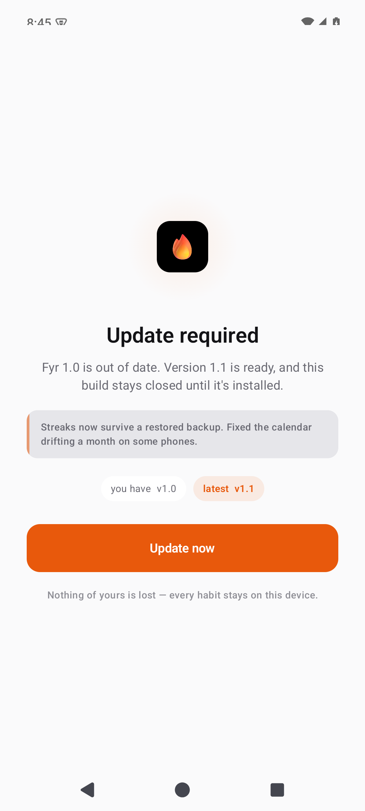

<div align="center">


# Fyr

**A habit tracker that never asks who you are.**

No account. No cloud. No analytics. Just your habits, your streaks,
and a fire that only goes out if you let it.

[](#install)
[](#build-it-yourself)
[](#build-it-yourself)
[](../../releases/latest)
[](LICENSE)

[**⬇️ Download Fyr 1.0**](../../releases/latest) &nbsp;·&nbsp; [Screenshots](#screenshots) &nbsp;·&nbsp; [Build it yourself](#build-it-yourself)

</div>

---

Fyr is a strict-but-kind habit tracker for one person: you. It counts a
streak only on the days your habit was actually due, forgives a day you
marked *excused* rather than failed, and puts every number it shows in
plain language — *28 of 28 days*, *since 22/08/2026*, *8 days to go*.

Everything happens on the handset. There is no server to send anything
to, no sign-up, and nothing to breach — because there is nothing stored
but a file only you can export.

## Install

**[Download Fyr 1.0.apk](../../releases/latest)** — one file, **2.6 MB**,
no dependencies.

1. Tap the `.apk` link. Your browser downloads it.
2. Open it. Android will say *"For your security, your phone currently
   isn't allowed to install unknown apps from this source."* — that is
   the normal sideload prompt, not a warning about Fyr.
3. Tap **Settings** → turn on **Allow from this source** → go back →
   **Install**.

That is the whole process. No Play Store, no account, no permission
wizard.

**Already have Fyr installed?** Install the new APK straight over the
old one — your habits stay exactly as they were. Never uninstall first.

<details>
<summary><b>Verifying the download</b></summary>

Every release is signed with one key. If a file ever stops verifying,
it is not Fyr:

```
SHA-256 of the signing certificate
9B:64:74:B2:60:A9:A3:1A:A2:16:AC:9F:4B:96:C7:49:ED:74:3D:E4:4B:FE:EE:FD:81:4F:0B:83:E5:73:29:4F
```

```sh
apksigner verify --print-certs fyr-v1.0.apk
```

</details>

## Screenshots

<table>
  <tr>
    <td align="center" width="33%">
      
      <br><sub><b>First launch</b></sub>
    </td>
    <td align="center" width="33%">
      
      <br><sub><b>Today</b></sub>
    </td>
    <td align="center" width="33%">
      
      <br><sub><b>Calendar</b></sub>
    </td>
  </tr>
  <tr>
    <td align="center">
      
      <br><sub><b>Insights</b></sub>
    </td>
    <td align="center">
      
      <br><sub><b>Habit detail</b></sub>
    </td>
    <td align="center">
      
      <br><sub><b>Profile &amp; backup</b></sub>
    </td>
  </tr>
  <tr>
    <td align="center">
      
      <br><sub><b>Trophy cabinet</b></sub>
    </td>
    <td align="center">
      
      <br><sub><b>Update required</b></sub>
    </td>
    <td></td>
  </tr>
</table>

## What it does

- **Streaks that mean something.** A streak counts *due* days in a row.
  A day your habit wasn't scheduled neither breaks nor extends it, and a
  day you marked **excused** shows up ice-blue in the heatmap instead of
  red.
- **Freezes, not guilt.** Skip days are first-class: one-off and
  recurring. The calendar draws them as ice so you can tell *"I was
  rested"* apart from *"I missed"*.
- **Honest percentages.** Rates end at *yesterday*, so a day you still
  have time to finish never drags your number down. *28 of 28 days* is
  the whole sentence.
- **Calendar, Insights and trophies** — a month grid, a six-month
  heatmap, top performers, and a cabinet of milestones you actually
  earned.
- **A home-screen widget** that follows your streaks.
- **Backup you own.** Export one JSON file. Import it as a **merge**
  (this phone wins on conflicts — a deleted habit is never resurrected)
  or a **replace**. Importing the same file twice changes nothing.

## Your data

Fyr's promise is a property of the *build*, not a privacy policy — the
build fails if the promise breaks.

| | |
|---|---|
| **Accounts** | None. There is nothing to sign into. |
| **Cloud backup** | Disabled three separate ways (`allowBackup=false`, `fullBackupContent`, `dataExtractionRules`). |
| **Storage permissions** | None. Files move only through the system picker you open yourself. |
| **Permissions** | Exactly three: `VIBRATE` (haptics), `INTERNET` (below), and the signature-level receiver guard AndroidX adds itself. |
| **Analytics / trackers / ads** | None. |

**About that `INTERNET` permission:** a sideloaded APK has no app store
to tell it a newer version exists, so on launch Fyr does *one* HTTPS GET
of a public version file — [`releases/version.json`](releases/version.json)
— which returns a version number and nothing else. No identifiers are
sent, no identifiers are received, and the host is pinned in the source.

The build enforces this. `./gradlew :app:check` reads the **merged**
manifest — where any dependency could slip a permission in — and fails
if the permission set drifts from those three by even one entry.

## Updates

When a newer version is published, the next launch of Fyr shows a
full-screen **Update required** gate with a single button to the release
page. It cannot be dismissed, and the app behind it is never composed
until the running build is current.

- The verdict is stored locally, so once Fyr knows it is behind, it
  blocks **even with the radio off**.
- Installing the new APK over the old one clears it automatically — no
  cache to wipe, no flag to reset.
- If the check cannot reach the network and Fyr has no stored verdict,
  it opens normally. A habit tracker that refuses to start on a train
  is worse than one that misses an update notice for a day.

> Why not push notifications? Because a background service polling a
> server is exactly what this app promises not to be. The check happens
> at launch, once, and costs one small request.

## Build it yourself

Requires **JDK 17** and the Android SDK (platform 35, build-tools 35).

```sh
git clone https://github.com/su6osec/fyr.git
cd fyr

# Debug build + tests + permission check + lint
./gradlew :app:assembleDebug \
          :app:testDebugUnitTest \
          :app:check \
          :app:lintDebug
```

| Check | Result |
|---|---|
| Unit tests | **38 passing**, 0 failing |
| Lint | **0 errors**, 9 warnings (all pre-existing: dependency suggestions and API-gated attributes) |
| Permission gate | passes — exactly `VIBRATE`, `INTERNET`, and AndroidX's receiver guard |
| APK | 2.6 MB, R8-minified, resource-shrunk, zipaligned, v2-signed |

To build a signed release you need a keystore and four Gradle
properties — they live outside the repository by design and are never
committed:

```properties
# ~/.gradle/gradle.properties
FYR_KEYSTORE=/path/to/release.jks
FYR_STORE_PASSWORD=…
FYR_KEY_ALIAS=fyr
FYR_KEY_PASSWORD=…
```

```sh
./gradlew :app:assembleRelease   # unsigned if those are absent
```

## Cutting a release

Maintainer-only. Three files move, in this order:

1. **Bump the build** in [`app/build.gradle.kts`](app/build.gradle.kts) —
   raise **both** `versionCode` (integer, never reused) and `versionName`.
2. **Announce it** in [`releases/version.json`](releases/version.json) —
   set `versionCode` to the *new* number, plus `versionName`, `url` and
   `notes`. This file is the update gate's only input; the app blocks
   the moment its number is behind.
3. **Publish** the APK as a GitHub Release and push the two file
   changes.

```sh
./gradlew :app:assembleRelease
gh release create "v$(grep versionName releases/version.json | cut -d'"' -f4)" \
  app/build/outputs/apk/release/app-release.apk \
  --title "Fyr $VERSION" --notes-file CHANGELOG.md
```

Bump `versionCode` *before* you publish, never after: everyone running
the old build finds out on their next launch.

## Support

<!-- Support button goes here — link a GitHub Sponsors / Buy Me a Coffee
     page when it exists. The README will grow a proper section then. -->

Fyr is free, ad-free and account-free. If it earned a place on your home
screen and you would like to give something back, that is appreciated —
but it will always be optional, and it will never unlock a feature.

## Fonts & assets

- **Poppins** — Google Fonts, [SIL OFL 1.1](https://openfontlicense.org/).
- **Qurova** — display face, by Prioritype, **licensed for personal use
  only** and *not* covered by this repo's MIT licence. It ships with Fyr
  because this is a personal project; if you fork this to publish or
  sell, replace it or [buy the family](https://prioritype.com/).
- Emoji artwork is rendered from Twemoji/Noto-style assets.

## License

[MIT](LICENSE) — see the file for the full text.

The bundled fonts are under their own licences, noted above.
